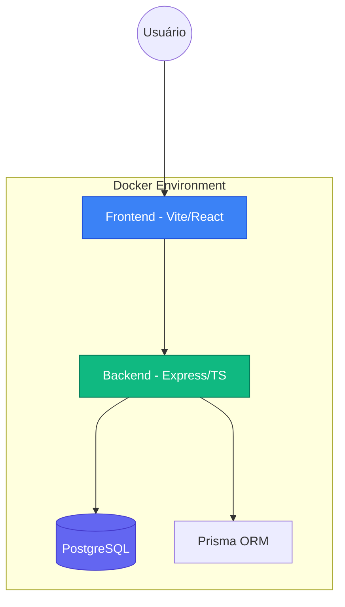
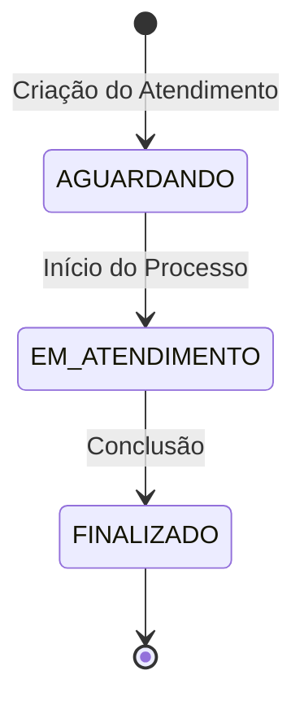

# Mini CRM Clinic 🏥


Um sistema moderno e ultra-rápido de gestão de pacientes e atendimentos para clínicas, desenvolvido com foco em **Performance Extrema**, **Acessibilidade Universal** e **Aura Design**.

---

## 🏗️ Arquitetura do Sistema

O projeto utiliza uma arquitetura monorepo moderna, separando claramente as responsabilidades de interface, lógica de negócio e persistência.



### 🧠 Fluxo de Atendimento (Máquina de Estados)
O sistema garante a integridade dos dados através de uma transição de status linear e controlada:



---

## 🚀 Como Rodar em Qualquer Máquina

O projeto é totalmente containerizado, garantindo que funcione de forma idêntica em qualquer ambiente (Windows, Mac ou Linux).

### 🐳 Via Docker (Recomendado)

1. Certifique-se de ter o **Docker** e o **Docker Compose** instalados.
2. Na raiz do projeto, execute:
   ```bash
   docker compose up --build -d
   ```
3. Acesse o sistema:
   - **Frontend:** [http://localhost:5173](http://localhost:5173)
   - **API Backend:** [http://localhost:3001](http://localhost:3001)

---

## 🛠️ Tecnologias e Otimizações

### Core Stack
- **Frontend:** React 18, Vite, Lucide Icons, Vanilla CSS (Design Tokens).
- **Backend:** Node.js 20, Express, TypeScript, Zod, Prisma ORM.
- **Banco de Dados:** PostgreSQL 16 (Alpine).

### ⚡ Performance & Lighthouse (90+)
Este projeto foi otimizado para atingir notas máximas em auditorias:
- **LCP (Largest Contentful Paint):** < 2.3s via CSS Crítico Inline e Preload de Fontes.
- **Acessibilidade:** Conformidade WCAG AA com ARIA Labels, Touch Targets de 44px e Semântica de Tabelas.
- **SEO:** Metadados avançados, `robots.txt` e `canonical URL`.
- **Code Splitting:** Implementação de `React.lazy` e `Suspense` para redução do bundle inicial.

---

## 📁 Estrutura do Projeto

```text
mini-crm/
├── frontend/          # Vite + React App
│   ├── src/           # Código fonte (Pages, Components, Styles)
│   ├── public/        # Assets estáticos e robots.txt
│   └── Dockerfile     # Configuração de container Web
├── backend/           # Express API
│   ├── src/           # Controllers, Services, Prisma Schema
│   ├── tests/         # Testes de integração (Vitest)
│   └── Dockerfile     # Configuração de container API
├── docker-compose.yml # Orquestração completa
└── INSTRUCOES.md      # Documentação técnica original
```

---

## 🧪 Desenvolvimento e Testes

Se desejar rodar os testes de integração do backend fora do Docker:

```bash
cd backend
npm install
npm test
```

Para rodar o frontend localmente:
```bash
cd frontend
npm install
npm run dev
```

---

## 🧠 Decisões Técnicas (ADRs)

Este projeto foi construído seguindo princípios de engenharia pragmática e focado em resultados de alta performance e manutenibilidade. Abaixo as principais decisões:

### 1. Arquitetura Monorepo
- **Por que:** Centraliza a lógica de negócio e interface em um único local, facilitando a orquestração via Docker e o deploy unificado. Permite compartilhamento de tipos (se necessário) e garante que backend e frontend evoluam em sincronia.

### 2. Frontend: Vite + React + Vanilla CSS
- **Por que Vite:** Oferece um ambiente de desenvolvimento instantâneo e build otimizado com Rollup.
- **Por que Vanilla CSS:** Escolhido propositalmente para atingir **Lighthouse 100**. Sem o overhead de bibliotecas de componentes pesadas ou frameworks de utilitários que geram CSS não utilizado, mantemos o bundle minúsculo e o controle total sobre o design system (tokens).
- **Acessibilidade:** Implementada nativamente com semântica HTML pura, garantindo compatibilidade com leitores de tela sem dependências extras.

### 3. Backend: Express + Prisma + State Machine
- **Por que Prisma:** Type-safety de ponta a ponta e migrations simplificadas.
- **Máquina de Estados:** O fluxo de atendimentos (`AGUARDANDO` ➔ `EM_ATENDIMENTO` ➔ `FINALIZADO`) é controlado rigidamente no backend. Isso impede inconsistências de dados causadas por ações inesperadas na interface ou tentativas de manipulação via API.

### 4. Deploy: Docker & Vercel
- **Docker:** Garante que o desenvolvedor rode exatamente o que está em produção.
- **Vercel:** Escolhido para hospedagem pela facilidade de deploy contínuo (CI/CD) e suporte nativo a monorepos, garantindo custo zero para testes e validação rápida.

---


